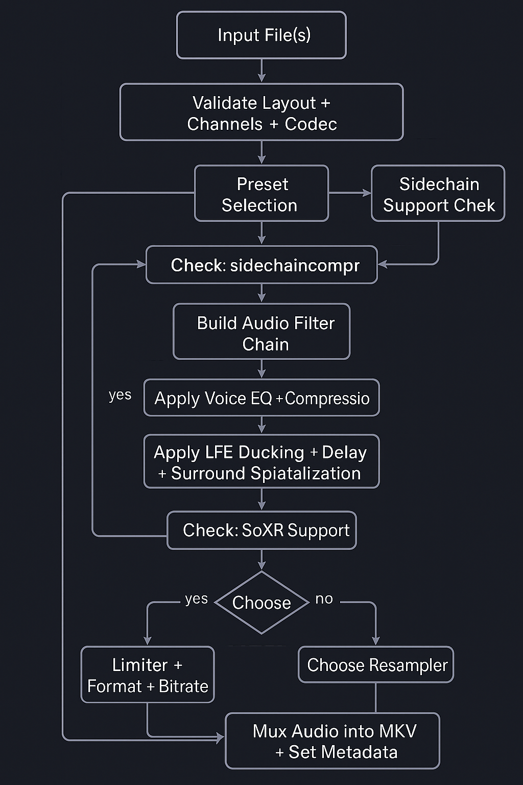

<!-- filepath: c:\Users\damocle\Desktop\README.md -->
# 🚀 ClearVoice la Stele di Rosetta per Audio 5.1 🔊

**2025 by "Sandro (D@mocle77) Sabbioni"**

Benvenuto, audionauta! Sei atterrato nella repository che custodisce il segreto per trasformare il tuo audio 5.1 da "uff" a "mammamia, che spettacolo!". ClearVoice 0.89 non è un semplice script, è una pipeline tecnologica forgiata per la massima chiarezza dei dialoghi, un controllo LFE innovativo e un audio così immersivo che ti sembrerà di avere una sala IMAX nel salotto!

---

## 🎯 Mission Statement (Perché ti serve questo script)

Hai presente quando guardi un film o una serie e i dialoghi sono soffocati dagli effetti sonori o dalla musica? O quando il subwoofer impazzisce e ti fa tremare le pareti anche durante le scene di dialogo? E quel suono piatto, come se tutto venisse da un unico punto?

ClearVoice 0.89 è la tua soluzione definitiva. Un algoritmo (in bash e awk, sì, proprio così!) che prende il tuo audio 5.1 e lo passa attraverso un **processo di ottimizzazione multi-stadio**. Il risultato? Dialoghi cristallini, bassi precisi e un ambiente sonoro che ti avvolge completamente.

---

## ✨ Feature List (Le Gemme di ClearVoice 0.89)

Ecco cosa rende ClearVoice un *must-have* nella tua toolbelt audio:

* **🎙️ Voice Boost Intelligente con Compressione Multi-Banda:** I dialoghi vengono amplificati e compressi dinamicamente per rimanere sempre in primo piano, senza distorcere. Addio "cosa ha detto?"!
* **🔊 VERO LFE Ducking Adattivo (Sidechain REALE!):** La funzione killer! Il tuo subwoofer reagirà magicamente alla voce. Quando c'è parlato, il basso si "abbassa" delicatamente per non coprire i dialoghi. Quando il parlato finisce... BOOM! Il basso torna con tutta la sua potenza. E la cosa migliore? Rileva automaticamente se FFmpeg supporta il *vero* sidechain compression, altrimenti usa un fallback intelligente.
* **🎭 Soundstage Spaziale POTENZIATO:** Non è un trucco da salotto! Usiamo **delay temporali PERCETTIBILI** sui canali frontali (3-6ms) e surround (20-35ms) per creare una profondità stereofonica e un ambiente surround che ti catapultano al centro dell'azione. Ti sembrerà di sentire l'eco della Death Star!
* **🛡️ Limitatore Anti-Clipping con Soft-Clipping Adattivo:** Non importa quanto tu spinga l'audio, ClearVoice protegge il segnale dal clipping (quella spiacevole distorsione). Mantiene il tutto pulito e croccante.
* **🎛️ Crossover LFE Professionale:** Filtri highpass e lowpass sul canale LFE per modellare la risposta in frequenza del subwoofer, garantendo bassi puliti, precisi e d'impatto, senza sbavature.
* ** Preset Ottimizzati:** Non sai da dove iniziare? Abbiamo preset pre-calibrati per ogni scenario:
    * `--film`: Per l'esperienza cinematografica definitiva, con ducking moderato e soundstage ampio.
    * `--serie`: Dialoghi al top, con ducking più aggressivo e soundstage compatto per l'ascolto domestico.
    * `--tv`: Il tuo salvavita per materiale audio di bassa qualità o molto compresso, con ducking ultra e equalizzazione dialoghi dedicata.
    * `--cartoni`: Per un audio divertente e vivace, con ducking gentile e soundstage espanso.
* **⚙️ Supporto Codec Multipli:** Gestisce EAC3 (default), AC3 e DTS, con parametri di qualità ottimizzati per ognuno.
* **🌠 SoXR Resampler:** Se la tua build di FFmpeg lo supporta, useremo SoXR, il *sacro graal* dei ricampionatori, per una qualità audio finale senza compromessi (precisione a 28 bit!).
* **Gestione Robusta:** Validazione degli input, auto-discovery dei file MKV e controllo sovrascrittura. Questo script è più solido di un vibranio!

---

## 🛠️ Requisiti di Sistema (La Tua Battlestation)

Per far girare questa meraviglia avrai bisogno di:

* **Bash:** Ma certo, è uno script bash! (Già presente sulla maggior parte dei sistemi Unix-like/Linux/macOS. Su Windows, Git Bash o WSL sono i tuoi amici).
* **FFmpeg:** La versione 6.0 o superiore è consigliata per le feature più avanzate (specialmente il `sidechaincompress`). Assicurati che sia nel tuo `PATH`.
* **`awk`:** Per calcoli matematici sicuri. (Anche questo è quasi sempre di default).
* **(Opzionale ma consigliato) SoXR con FFmpeg:** Se vuoi il massimo della qualità SoXR, assicurati che la tua build di FFmpeg sia stata compilata con `--enable-libsoxr`. Altrimenti, useremo `swresample` come fallback.

---

## 🚀 Guida Rapida all'Uso (Il Tuo Manuale per l'Innesco)

Naviga nella directory dello script e rendilo eseguibile (se non lo è già):

```bash
chmod +x clearvoice089_preset.sh
```

Poi, lancia il comando con i tuoi parametri. La sintassi è intuitiva:

```bash
./clearvoice089_preset.sh [PRESET] [CODEC] [BITRATE] [FILES/DIRECTORIES...]
```

### Esempi Pratici (Comandi per i N00b e i PRO)

* **Ottimizza tutti i file `.mkv` nella directory corrente per le serie TV (preset di default, ducking aggressivo):**
    ```bash
    ./clearvoice089_preset.sh --serie *.mkv
    ```

* **Elabora un film con preset "Film", codec DTS a 768k bitrate:**
    ```bash
    ./clearvoice089_preset.sh --film dts 768k "Il_mio_film_epico.mkv"
    ```

* **Renditi conto che l'audio di quel vecchio DVD rippato è terribile e salvalo col preset "TV", codec AC3 448k:**
    ```bash
    ./clearvoice089_preset.sh --tv ac3 448k "Vecchia_serie_TV_rovinata.mkv"
    ```

* **Dai vita ai cartoni animati con il preset "Cartoni", lasciando il codec e bitrate di default (EAC3 640k):**
    ```bash
    ./clearvoice089_preset.sh --cartoni "Cartone_animato_fantastico.mkv"
    ```

* **Vuoi solo sapere le opzioni disponibili?**
    ```bash
    ./clearvoice089_preset.sh --help
    ```

### Output File (Il Tuo Tesoro Finale)

Lo script genererà un nuovo file nella stessa directory, con un nome simile a:
`nome_del_file_originale_[preset]_clearvoice0.mkv`

La traccia audio ClearVoice sarà impostata come default per una riproduzione automatica senza sbattimenti!

---

## 🧠 Dettagli Tecnici (Per i Veri Ingegneri del Suono)

* **Ducking Implementation:** L'utilizzo di `sidechaincompress` con `asplit` è la prova di un **VERO sidechain**, dove il canale centrale funge da "chiave" per comprimere il LFE. Se `sidechaincompress` non fosse disponibile, il fallback ad `acompressor` mantiene la funzionalità seppur in modo simulato.
* **Soundstage Precisione:** I valori di `adelay` sono stati scelti per essere *percettibili*, non solo cosmetici. A 48kHz, 1ms corrisponde a 48 campioni.
* **Filtri Voce:** L'applicazione combinata di `highpass`, `lowpass` e `equalizer` sul canale centrale mira a isolare e migliorare la gamma di frequenze della voce umana per la massima chiarezza.
* **Limitatore Adattivo:** `alimiter` con `asc=1` (adaptive soft clipping) non solo previene la distorsione ma lo fa in modo intelligente, adattandosi al segnale.

---


---

## 🗺️ Schema Grafico del Flusso Audio

Per i visual thinkers, ecco un diagramma che rappresenta in modo chiaro e sintetico il flusso di elaborazione audio realizzato da `clearvoice089_preset.sh`.



**Legenda del processo:**
1. **Input Audio Stream:** file audio 5.1 in formato `.mkv`
2. **Preset Selection:** selezione di uno tra `film`, `serie`, `tv`, `cartoni`
3. **Voice Processing:** boost + EQ + compressione voce dinamica
4. **LFE Ducking Adattivo:** subwoofer controllato dalla voce con `sidechaincompress` (reale o simulato)
5. **Soundstage Spatialization:** delay su canali frontali e surround per immersione sonora
6. **Limiting & Resampling:** anti-clipping e SoXR se disponibile
7. **Output Audio Stream:** traccia 5.1 ottimizzata e integrata nel nuovo `.mkv`

## 🤝 Contribuisci (Unisciti alla Resistenza Audio!)

Se hai idee, bug da segnalare o vuoi contribuire con miglioramenti al codice, sentiti libero di aprire una Issue o una Pull Request! L'audio di qualità è un diritto, non un privilegio!

---

**Licenza:** Questo script è distribuito sotto licenza MIT.

---

Preparati a un'esperienza sonora che ti farà dire "Wow!" Adesso non ti resta che clonare la repo e far cantare i tuoi altoparlanti! 🎶

---

## 🎯 CARATTERISTICHE PRINCIPALI

- 🎙️ **Voice boost intelligente con compressione multi-banda**
- 🔊 **LFE Ducking**: Il subwoofer reagisce automaticamente alla voce (sidechain REALE o EMULATO)
- 🌌 **Soundstage spaziale**: Delay temporali PERCETTIBILI per profondità stereofonica e surround
- 🚫 **Limitatore anti-clipping** con soft-clipping adattivo
- 🎚️ **Crossover LFE professionale** per controllo frequenze
- 🎞️ **Preset ottimizzati** per diversi contenuti (Film, Serie, TV, Cartoni)
- 📦 **Supporto codec multipli**: EAC3, AC3, DTS con parametri qualità ottimizzati
- 🧠 **Gestione robusta** formati audio con fallback intelligenti
- 🎧 **SoXR resampler** per qualità audio superiore (richiede build FFmpeg con SoXR)

---

## 🔬 ANALISI TECNICA DETTAGLIATA

### 1. 🎙️ Equalizzazione voce italiana
**FILM**: Boost 3kHz (+1.5dB), Cut 5kHz (-1dB)  
**SERIE**: Boost 2.5kHz (+2dB), Cut 4.5kHz (-1.5dB), Boost 1.5kHz  
**TV**: Boost 1kHz (+2.5dB), Boost 3kHz (+2dB), limitazione sopra i 5.5kHz  
**CARTONI**: Boost 3.5kHz, Cut 6kHz leggero  
→ Ottimizzato per l'intelligibilità del parlato italiano

### 2. 🔊 Subwoofer intelligibile
- Crossover 25–110Hz (2° ordine)
- Boost 40Hz e 70Hz per presenza e calore
- Attenuazione LFE (-13dB)
→ Sub potente ma mai invasivo

### 3. 🌌 Soundstaging spaziale
- Front Delay: configurabile (default 0ms)
- Rear Delay: configurabile (default 0ms) 
→ Configurabile: Preset disponibili da 4ms/25ms fino a 12ms/35ms per AVR statici

### 4. 💬 Potenziamento voce
- Gain +8.7dB
- Compressione 3.5:1 (attack 15ms, release 200ms)
- Softclip threshold 0.97
→ Voce chiara e ben presente in ogni scena

### 5. 🧨 Ducking LFE intelligente
- Threshold -32dB, Ratio 5.5:1, Attack 15ms, Release 300ms
- Sidechain reale o fallback emulato
→ Il sub "rispetta" la voce con maggiore sensibilità

### 6. 🎧 SoXR Resampling
- Film: 28-bit
- Serie/TV: 20-bit
- Cartoni: 15-bit
→ Conversione di alta qualità, fallback a SWR se SoXR non presente

---
