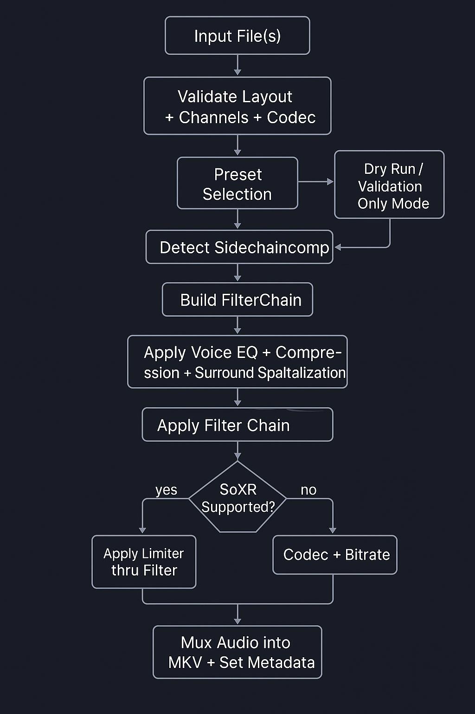

# 🚀 ClearVoice – La Stele di Rosetta per Audio 5.1 🔊

**2025 by "Sandro (D@mocle77) Sabbioni"**

Benvenuto audionauta! ClearVoice è la "pipeline definitiva" sviluppata con attenzione nerd in Bash Scripting + AWK per ottimizzare l’audio 5.1! Avrai dialoghi cristallini, subwoofer arioso e compatibilità totale con tutti i codec principali (ac3-eac3-dts). Ottimizzata con focus sull'intellegibilità della lingua italiana, arricchita con sidechain multicanale + ducking dinamico e SoXR resampling HD per qualità superiore.

---

## 🎯 Mission Statement (A cosa serve questo Script?)

Quante volte hai dovuto smanettare con il volume per sentire correttamente i dialoghi? O hai sentito il subwoofer coprire tutto? ClearVoice prende il tuo audio 5.1 standard e lo trasforma con una pipeline di ottimizzazione multi-stadio: dialoghi in primo piano, LFE controllato, ambiente sonoro caldo ed avvolgente....questa è la via!!!

---

## ✨ Feature List (La tua battlestation!)

- **🎙️ Voice Boost Multi-Stadio:** Denoise → Filtri → EQ → Compressore → Volume → Limiter. Ottimizzazione specifica per voce italiana.
- **🔊 Ducking Multicanale Ultra-Sensibile:** Sidechain su TUTTI i canali, rilevamento voce anche a bassissimo volume, parametri professionali.
- **🎚️ LFE Processing Avanzato:** Crossover configurabile, ducking LFE sensibile, equalizzazione subwoofer specifica.
- **🎛️ Preset Specializzati:** Film, Serie, TV, Cartoni. Parametri calibrati per ogni scenario.
- **⚙️ Codec Multipli:** EAC3, AC3, DTS con parametri ottimizzati e gestione automatica layout.
- **🌠 SoXR Resampling:** Precisione adattiva (28/20/15-bit), fallback automatico a SWR.
- **🧠 Gestione Robusta:** Validazione multi-formato, batch processing, logging dettagliato, resume capability.
- **🛡️ Protezione Anti-Clipping Doppia:** Limiter + softclip programmabile.

---

## 🛠️ Tecnologie Utilizzate

- **Bash, AWK:** Motore di scripting e calcoli robusti.
- **FFmpeg (>=6.0):** Filtri avanzati (sidechaincompress, limiter, equalizer, compressor, denoise, join/split canali).
- **SoXR:** Resampler di qualità superiore.
- **Compatibilità totale:** Linux, macOS, Windows (WSL/GitBash). Nessuna dipendenza proprietaria.

---

## 🚀 Guida Rapida all'Uso

Rendi eseguibile lo script:

```bash
chmod +x clearvoice095_preset.sh
```

Esegui con i parametri desiderati:

```bash
./clearvoice095_preset.sh --film eac3 768k "Film_epico.mkv"
./clearvoice095_preset.sh --serie ac3 640k *.mkv
./clearvoice095_preset.sh --tv dts 768k "Serie_TV.mkv"
./clearvoice095_preset.sh --cartoni ac3 640k "Cartone_animato.mkv"
```

- **Preset disponibili:** `--film`, `--serie`, `--tv`, `--cartoni`
- **Codec supportati:** `ac3`, `eac3`, `dts`
- **Bitrate suggeriti:** `384k`, `640k`, `768k`, `756k`, `1536k`

---

## 🗺️ Schema Grafico del Flusso Audio



**Legenda del flowchart:**

1. **Input File(s)**
2. **Validazione Layout + Canali + Codec**
3. **Preset Selection**
4. **Rilevamento Sidechaincompress**
5. **Costruzione FilterChain**
6. **Applica Voice EQ + Compressione + Surround Spatialization**
7. **Applica Filter Chain**
8. **SoXR se Supportato da ffmpeg**
9. **Mux Audio in MKV + Set Metadata**

---

## 🔬 Analisi Tecnica Dettagliata

- **Ducking Multicanale:** Sidechain su FL/FR/LFE/BL/BR, threshold fino a -47dB, attack/release ottimizzati.
- **Voice Processing:** EQ dedicata per voce italiana (800Hz, 2200-2800Hz), compressione multi-banda, limiter anti-distorsione.
- **LFE Processing:** Filtri crossover configurabili, ducking LFE sensibile, EQ subwoofer specifica.
- **Preset:** Parametri scientificamente calibrati per ogni scenario.
- **Codec:** Adattamento automatico layout e parametri per EAC3, AC3, DTS.
- **SoXR:** Precisione variabile per preset, fallback automatico.

---

## 🤝 Contribuisci

Hai idee o bug? Apri una Issue o una Pull Request!

**Licenza:** MIT

---

*E ora... lascia che i tuoi altoparlanti suonino... nel modo giusto!, La qualità non è un privilegio, è un diritto per tutti!*


